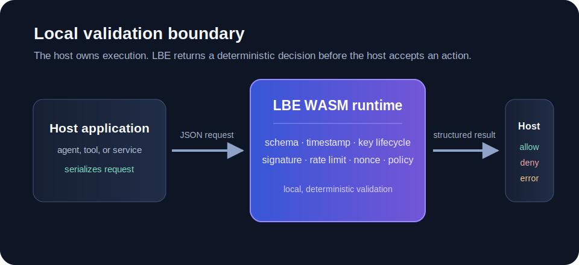

# @letterblack/lbe-core

<p align="center">
  <a href="https://www.npmjs.com/package/@letterblack/lbe-core"></a>
  =20.9" src="https://img.shields.io/badge/node-%3E%3D20.9-3f3f46">
  
  
  
</p>

<p align="center">
  
</p>

<p align="center">
  <strong>Local execution-control for AI agents.</strong><br>
  Validate file, command, and state-changing actions before your host application executes them.
</p>

<table>
  <tr>
    <td><strong>Block unsafe actions</strong><br>Validate proposed file and command operations before execution.</td>
    <td><strong>Keep policy local</strong><br>No cloud service, no daemon, no API key. Policy stays on the machine.</td>
    <td><strong>Audit decisions</strong><br>Record allow/deny results in a local tamper-evident log.</td>
  </tr>
</table>

---

## Quick start

```bash
npm install @letterblack/lbe-core
npx lbe init
npx lbe status
npx lbe enforce
```

Requires Node.js >= 20.9.0.

---

## Why LBE exists

AI agents can propose file changes, commands, API calls, and state updates. Prompts and manual review are not enforcement. LBE gives your host application a local decision boundary before execution.

```text
Agent proposes action
        ↓
LBE validates local policy
        ↓
allow / deny / error
        ↓
Host executes only if approved
        ↓
Decision is written to local evidence
```

Your application remains in control. LBE does not execute on your behalf. It returns a structured decision that your host can enforce.

---

## How validation works

<p align="center">
  
</p>

Each routed request is checked for schema, timing, replay protection, rate limits, authenticity, and policy. A denied request returns the stage and reason so your host can log, explain, or recover.

---

## Allow and deny paths

<table>
  <tr>
    <td></td>
    <td></td>
  </tr>
</table>

---

## CLI reference

| Command | What it does |
|---|---|
| `npx lbe init` | Create `lbe.policy.json` in observer mode |
| `npx lbe status` | Show policy mode, rules, and workspace state |
| `npx lbe policy` | Print the current policy file |
| `npx lbe observe` | Switch to advisory mode — logs but does not block |
| `npx lbe enforce` | Switch to blocking mode — denies policy violations |
| `npx lbe execute` | Validate a JSON proposal from stdin |
| `npx lbe execute --input <file>` | Validate a JSON proposal from a file |

---

## Programmatic API

```js
import { execute } from '@letterblack/lbe-core';

const result = JSON.parse(execute(JSON.stringify(proposal)));

if (result.decision === 'allow') {
  // approved by LBE
} else {
  console.error(result.error.stage, result.error.message);
}
```

`execute(input: string): string` is synchronous. It accepts JSON and returns JSON. The WASM runtime owns the validation decision.

### Decision responses

Allowed:

```json
{
  "ok": true,
  "decision": "allow",
  "request_id": "req-001",
  "result": { "type": "allowed" }
}
```

Denied:

```json
{
  "ok": false,
  "decision": "deny",
  "request_id": "req-001",
  "error": { "stage": "policy", "message": "rule:deny_outside_workspace" }
}
```

---

## Observer mode

Start in observer mode when you do not yet know the agent's normal behavior.

```bash
npx lbe init
npx lbe status
npx lbe enforce
npx lbe observe
```

Observer mode uses the same decision format as enforcement, but policy violations are advisory until you switch to enforce mode.

---

## What ships in this package

```text
dist/index.js               WebAssembly runtime loader — exports execute()
dist/cli.js                 CLI (npx lbe)
dist/lbe_engine.wasm        Verified runtime binary
dist/wasm.lock.json         Runtime integrity lock
assets/lbe-gates.jpg        Gate sequence diagram
assets/lbe-gates.png        Gate sequence diagram
assets/story-allow.jpg      Approved-request flow
assets/story-allow.png      Approved-request flow
assets/story-deny.jpg       Blocked-request flow
assets/story-deny.png       Blocked-request flow
assets/runtime-boundary.svg Runtime boundary diagram
types.d.ts                  TypeScript declarations
LICENSE
```

At load time the runtime verifies `lbe_engine.wasm` against `wasm.lock.json`. A missing, modified, or swapped binary fails before any request is processed.

---

## What LBE does not do

LBE is not a sandbox, container, or OS-level isolation layer. It controls only the actions that your host routes through it.

- Does not provide kernel-level process isolation
- Does not control network egress
- Does not provide multi-tenant separation
- Does not run a hosted control plane

If the agent acts outside your host's `execute()` boundary, LBE does not see that action.

---

## Limits

- Central writes are best-effort
- Local logs remain local
- Non-inspectable targets may produce limited evidence
- Per-process state resets on restart unless you configure a persistent path
