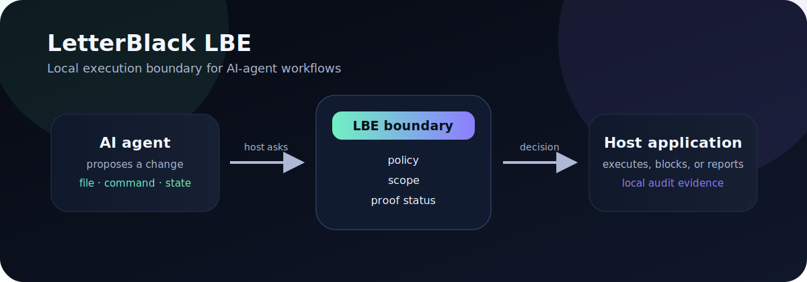
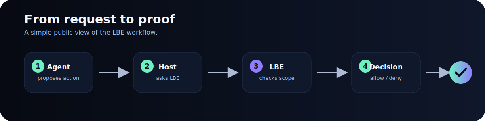
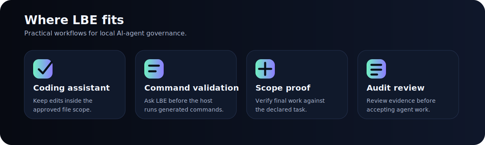
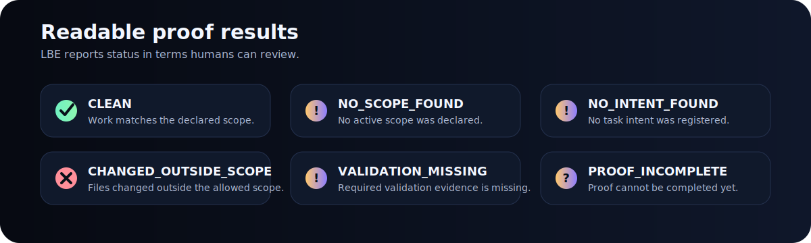

# LetterBlack LBE

<p align="center">
  <a href="https://www.npmjs.com/package/@letterblack/lbe-core"></a>
  =20.9" src="https://img.shields.io/badge/node-%3E%3D20.9-0F172A?labelColor=070A12">
  
  
</p>

<p align="center">
  
</p>

<p align="center">
  <strong>Local execution boundary for AI agents.</strong><br>
  LBE helps your application validate agent actions before your host executes them.
</p>

---

## Install

```bash
npm install @letterblack/lbe-core
```

Requires Node.js `>= 20.9.0`.

## Quick start

```bash
npx lbe init
npx lbe status
npx lbe scope
npx lbe intent
npx lbe proof
```

Use this first flow:

```text
Initialize LBE → check status → declare/inspect scope → track intent → verify proof
```

---

## What LBE does

LBE gives your host application a local decision boundary for AI-agent actions routed through it.

When an agent proposes a file change, shell command, or state-changing action, your host can ask LBE first. LBE returns a structured result, and your host decides whether to execute, block, or report the issue.

<p align="center">
  
</p>

---

## Why it is needed

AI agents can be useful, but prompt-only control leaves gaps.

| Gap | What can happen | How LBE helps |
|---|---|---|
| Scope drift | The agent edits files outside the task | Proof can report `CHANGED_OUTSIDE_SCOPE` |
| Wrong target | The agent writes to the wrong path | Policy and scope can validate the proposed target |
| Missing validation | The agent says work is done without checks | Proof can report `VALIDATION_MISSING` |
| Hidden changes | Final files do not match the request | LBE records local evidence for review |
| No boundary | The model decision goes straight to execution | Your host can ask LBE before acting |

LBE makes agent work more explicit, scope-bound, auditable, and reviewable.

---

## Practical scenarios

<p align="center">
  
</p>

| Scenario | Example use |
|---|---|
| AI coding assistant | Limit a task to `src/**`, forbid `.env`, and require tests before accepting the work |
| Command validation | Ask LBE before the host executes generated shell commands |
| Scope proof | Check whether the final changes match the declared task scope |
| Audit review | Keep local evidence for what was allowed, denied, incomplete, or outside scope |

---

## Common commands

| Command | Purpose |
|---|---|
| `npx lbe init` | Initialize LBE for the current workspace |
| `npx lbe status` | Show current workspace status |
| `npx lbe scope` | Inspect scope state |
| `npx lbe intent` | Inspect task intent state |
| `npx lbe proof` | Show the latest proof result |
| `npx lbe observe` | Use advisory mode |
| `npx lbe enforce` | Use blocking policy mode for routed actions |
| `npx lbe execute` | Validate a JSON proposal through the LBE boundary |

---

## Proof statuses users may see

<p align="center">
  
</p>

| Result | Meaning |
|---|---|
| `CLEAN` | Work matches the declared scope |
| `NO_SCOPE_FOUND` | No active scope was declared |
| `NO_INTENT_FOUND` | No task intent was registered |
| `CHANGED_OUTSIDE_SCOPE` | Files changed outside the allowed scope |
| `VALIDATION_MISSING` | Required validation evidence is missing |
| `PROOF_INCOMPLETE` | Proof cannot be completed yet |

---

## Minimal SDK usage

```js
import { execute } from '@letterblack/lbe-core';

const proposal = {
  version: '1.0',
  request_id: 'req-001',
  intent: {
    type: 'file',
    name: 'write_file',
    payload: { target: 'src/output.js' }
  }
};

const result = JSON.parse(execute(JSON.stringify(proposal)));

if (result.decision === 'allow') {
  console.log('Approved by LBE');
} else {
  console.log('Not approved:', result.error || result);
}
```

Use the SDK when your application controls the action path and can ask LBE before execution.

---

## Honest boundary

LBE is strongest when your host routes agent actions through it.

| LBE is | LBE is not |
|---|---|
| A local decision boundary | An operating-system sandbox |
| A scope and proof workflow | A global tool interceptor |
| An SDK and CLI for host-controlled workflows | A hosted control plane |
| A way to review routed agent work | A guarantee over tools that bypass it |

```text
LBE governs actions routed through its SDK or CLI boundary.
If another tool bypasses that boundary, LBE cannot govern that action unless the host environment routes it through LBE.
```

---

## Documentation

| Area | Where to look |
|---|---|
| Usage examples | `docs/` |
| Product boundary decisions | `docs/decisions/` |
| Security model and limits | `docs/` |
| Package entrypoint | `dist/` in the published package |

The README is intentionally human-facing. Deep runtime details belong in technical docs, not the front page.

---

## License

Proprietary.

<p align="center">
  <strong>LetterBlack LBE</strong><br>
  Local execution governance for AI-agent workflows.
</p>
