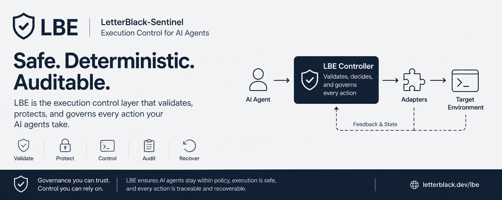
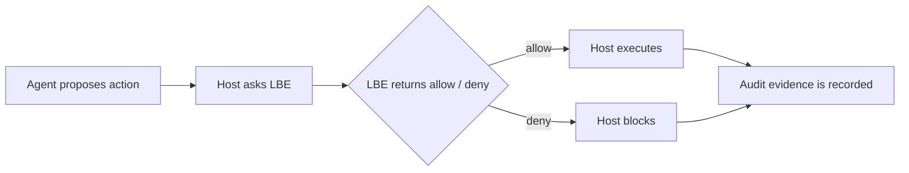

# @letterblack/lbe-core

<p align="center">
  
</p>

[](https://www.npmjs.com/package/@letterblack/lbe-core)


<p align="center">
  <strong>Local-first · SDK + CLI · Scope-aware proof</strong><br>
  Local execution boundary for AI agents.
</p>

LBE helps your application validate agent actions before your host executes them. It adds local proof, scope checking, and clearer visibility into what the agent was supposed to do versus what actually happened.

<table>
  <tr>
    <td>
      <strong>Beta status</strong><br>
      LBE is currently in beta. The current public package provides a local SDK and CLI for validating host-routed AI-agent actions, checking scope, and producing local proof/audit evidence.<br><br>
      Future releases will add stronger runtime execution control, including stricter file and shell routing, approval gates, rollback support, and deeper enforcement around agent-driven changes.
    </td>
  </tr>
</table>

<p align="center">
  <a href="#install-first-then-start-simple"><strong>Get started</strong></a>
  ·
  <a href="#common-commands"><strong>See commands</strong></a>
  ·
  <a href="#technical-visuals"><strong>Technical visuals</strong></a>
</p>

| No cloud service | Local policy | Local proof | Human-readable workflow |
|---|---|---|---|
| Runs in your workspace | You own the rules | Evidence stays local | Results are readable |

## How LBE fits into an agent workflow

A simple public diagram: proposal -> decision -> execution -> evidence.



## Install first, then start simple

The first thing users need is a clear install step and obvious commands.

### Install

```bash
npm install @letterblack/lbe-core
```

Requires Node.js >= 20.9.0.

### Quick start

```bash
npx lbe init
npx lbe status
npx lbe scope
npx lbe intent
npx lbe proof
```

Start with `status`, `scope`, and `proof` before going deeper.

## Why LBE exists

AI agents are powerful, but prompts alone do not create a durable contract. LBE helps your host check whether work stayed inside the intended scope and whether the final result can be trusted.

| Task clarity | Reviewable proof | Host-controlled execution |
|---|---|---|
| Make the objective, allowed files, forbidden files, and required checks explicit instead of implicit. | Check whether completed work matched the declared scope and whether evidence is complete. | Your application remains in control and decides whether to execute, reject, or report the proposed action. |

## Story flow

This is the visual narrative of how LBE fits into a real workflow.

| Step | Phase | What happens |
|---:|---|---|
| 1 | Define scope | Set the objective, required reading, allowed files, forbidden files, and required validation. |
| 2 | Start intent | Register the task intent so the work is tied to a clear purpose. |
| 3 | Agent works | The host or agent performs the work while the task remains scope-bound. |
| 4 | Check proof | LBE compares the final state against the declared scope and available validation evidence. |
| 5 | Return result | Get a readable result such as `CLEAN`, `NO_SCOPE_FOUND`, `CHANGED_OUTSIDE_SCOPE`, or `PROOF_INCOMPLETE`. |

## Without LBE / With LBE

| Without LBE | With LBE |
|---|---|
| The task may be described, but not truly tracked. | The task becomes a declared contract. |
| Unrelated files can be changed without clear visibility. | Proof can detect work outside scope. |
| The agent can say "done" without enough evidence. | Status can show missing scope, missing intent, or incomplete validation. |
| Review depends heavily on manual checking. | The host gets clearer decision support before accepting the work. |

## Visual infographics

These graphs are illustrative, not performance benchmarks. They explain what value LBE adds to agent workflows.

| Capability | Illustrative strength |
|---|---:|
| Task clarity | 92% |
| Scope visibility | 90% |
| Proof / audit readiness | 95% |
| Host decision support | 88% |
| Global hard blocking | 40% |

Note: hard blocking for all tool paths requires a stricter execution bridge.

## Common proof statuses

| Status | Meaning |
|---|---|
| `CLEAN` | Work matches the declared task scope. |
| `NO_SCOPE_FOUND` | No active scope was defined. |
| `NO_INTENT_FOUND` | The work was not tied to an intent. |
| `CHANGED_OUTSIDE_SCOPE` | Files changed outside allowed scope. |
| `VALIDATION_MISSING` | Required checks were not proven. |
| `PROOF_INCOMPLETE` | Evidence exists but is not complete yet. |

## Practical scenarios

| Scenario | How LBE helps |
|---|---|
| AI coding assistant | Limit the task to `src/**`, require tests, and detect drift if unrelated files were touched. |
| Command review | Use LBE as a decision step before your host executes generated shell commands. |
| Scope proof | Prove whether final work matched the approved objective instead of trusting the final message. |
| New project observation | Start with visibility and proof workflows before moving toward stricter enforcement patterns. |

## Common commands

| Command | Purpose |
|---|---|
| `npx lbe init` | Initialize LBE state for the workspace. |
| `npx lbe status` | Show current workspace status and high-level LBE state. |
| `npx lbe scope` | Inspect or manage scope-related status. |
| `npx lbe intent` | Inspect or begin the task intent lifecycle. |
| `npx lbe proof` | Show the latest proof result for the workspace. |
| `npx lbe execute` | Validate a JSON proposal through the LBE boundary. |
| `npx lbe observe` | Use advisory mode. |
| `npx lbe enforce` | Use blocking policy mode for routed actions. |

## Programmatic API

```js
import { execute } from '@letterblack/lbe-core';

const proposal = {
  version: '1.0',
  request_id: 'req-001',
  timestamp: Math.floor(Date.now() / 1000),
  actor: { id: 'agent:local', role: 'agent' },
  intent: {
    type: 'command',
    name: 'write_file',
    payload: { target: 'output.js' }
  },
  context: { workspace: process.cwd() },
  auth: { signature: '<host-signed>', token: '<unique-per-request>' }
};

const result = JSON.parse(execute(JSON.stringify(proposal)));
```

`execute(input: string): string` is synchronous, accepts JSON, and returns JSON. Your host decides what to do with the result.

## What ships in this package

```text
dist/index.js               WebAssembly runtime loader
dist/cli.js                 CLI (npx lbe)
dist/lbe_engine.wasm        Runtime binary
dist/wasm.lock.json         Runtime integrity lock
assets/banner.png           Public README banner
assets/runtime-boundary.svg Runtime boundary diagram
types.d.ts                  TypeScript declarations
LICENSE
```

Detailed visuals are kept in technical docs instead of the main README front page.

<a id="technical-visuals"></a>

## Technical visuals

For deeper reviewer context, see [Technical Visuals](https://github.com/Letterblack0306/LetterBlack-Sentinel/blob/main/docs/TECHNICAL_VISUALS.md).

## What LBE does not do

LBE is not a sandbox, container, or OS-level isolation layer. It controls only the actions that your host routes through it.

- Does not provide kernel-level process isolation
- Does not control network egress
- Does not prevent the agent from calling external APIs directly
- Does not provide multi-tenant separation
- Does not run a hosted control plane

If the agent calls the filesystem directly without going through your host code, LBE does not see it. LBE governs actions that are explicitly routed through the LBE boundary.
