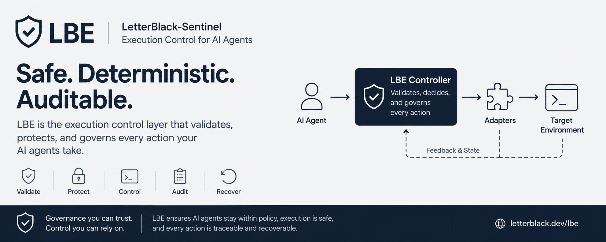
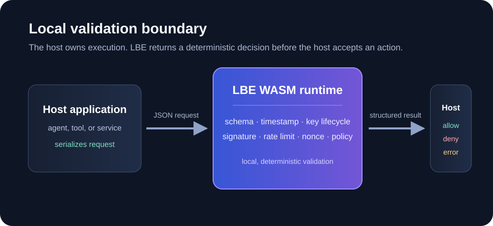
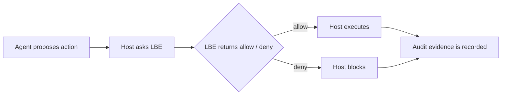

# @letterblack/lbe-core

<p align="center">
  
</p>

[](https://www.npmjs.com/package/@letterblack/lbe-core)


<p align="center">
  <strong>Local-first · Terminal-first · SDK + CLI · Scope-aware proof</strong><br>
  Local execution boundary for AI agents.
</p>

LBE helps your application validate agent actions before your host executes them. It adds local policy checks, scope-aware proof, audit visibility, and a terminal-first workflow for understanding what an agent was supposed to do versus what actually happened.

## AI agents are getting stronger. Their execution layer is not.

Today, most people judge AI agents by one thing: did it solve the task faster?

That works while agents are weak.

But agents already write files, run shell commands, control browsers, edit configs, and trigger workflows. Soon they will touch publishing, databases, deployments, credentials, and production systems.

At that point, "the agent meant well" is not enough.

LBE exists for the moment between an AI agent deciding what to do and the system actually doing it.

It checks the action, validates the boundary, records proof, and gives the host a clearer decision before accepting or executing the work.

Not another agent framework.  
Not another chat UI.  
Not another model wrapper.

LBE is the local execution-control layer for AI agents before they touch real systems.

<table>
  <tr>
    <td>
      <strong>Beta status</strong><br>
      LBE is currently in public beta. The current public package provides a local SDK and CLI for validating host-routed AI-agent actions, checking scope, and producing local proof/audit evidence.<br><br>
      LBE is terminal-first. Run <code>npx lbe</code> after installing the scoped package to open the local terminal menu; direct commands remain available for automation.<br><br>
      Execution remains local. The current public package is focused on local SDK and CLI workflows.
    </td>
  </tr>
</table>

> This repository is the public release mirror. Release/build authority lives in LetterBlack-LBE-Core.

<p align="center">
  <a href="#install-first-then-start-simple"><strong>Get started</strong></a>
  ·
  <a href="#common-commands"><strong>See commands</strong></a>
  ·
  <a href="#technical-visuals"><strong>Technical visuals</strong></a>
</p>

| Terminal-first | Local policy | Local proof | Local execution |
|---|---|---|---|
| Branded terminal menu | You own the rules | Evidence stays local | All operations stay on your machine |

## How LBE fits into an agent workflow

A simple public diagram: proposal -> decision -> execution -> evidence.

<p align="center">
  
</p>


```mermaid
flowchart LR
  A["Agent proposes action"] --> B["Host asks LBE"]
  B --> C{"LBE returns allow / deny"}
  C -->|allow| D["Host executes"]
  C -->|deny| E["Host blocks"]
  D --> F["Audit evidence is recorded"]
  E --> F
```

## Install first, then start simple

Install the package, then start with the terminal menu or direct CLI commands.

### Install

```bash
npm install @letterblack/lbe-core
```

Requires Node.js >= 20.9.0.

### Quick start

```bash
npx lbe
npx lbe init
npx lbe status
npx lbe scope
npx lbe intent
npx lbe proof
```

Start with `npx lbe` for the terminal menu, or use direct commands for scripts and automation.

For a one-off run before local install, use the scoped package explicitly:

```bash
npx --yes --package @letterblack/lbe-core@latest lbe
```

Do not rely on bare `npx lbe` before installation; npm may resolve an unrelated package named `lbe`.

## Terminal-first workflow

Sentinel is designed to stay close to the workspace. Running `npx lbe` with no arguments opens a branded terminal menu (TUI) that displays the LBE logo, workspace status, policy mode, proof status, and a numbered action menu.

Users can select actions interactively (Apply Boundary, Remove Boundary, Check Status, Audit Workspace, Agent Instructions, Exit) or use direct commands for repeatable automation. Observe and enforce modes are available as direct CLI commands, not menu actions.

## Why LBE exists

AI agents are powerful, but prompts alone do not create a durable contract. LBE helps your host check whether work stayed inside the intended scope and whether the final result can be trusted.

| Task clarity | Reviewable proof | Host-controlled execution |
|---|---|---|
| Make the objective, allowed files, forbidden files, and required checks explicit instead of implicit. | Check whether completed work matched the declared scope and whether evidence is complete. | Your application remains in control and decides whether to execute, reject, or report the proposed action. |

## Story flow

This is the visual narrative of how LBE fits into a real workflow.

| Step | Phase | What happens |
|---:|---|---|
| 1 | Define scope | Set the objective, required reading, allowed files, forbidden files, and required validation. |
| 2 | Start intent | Register the task intent so the work is tied to a clear purpose. |
| 3 | Agent works | The host or agent performs the work while the task remains scope-bound. |
| 4 | Check proof | LBE compares the final state against the declared scope and available validation evidence. |
| 5 | Return result | Get a readable result such as `CLEAN`, `NO_SCOPE_FOUND`, `CHANGED_OUTSIDE_SCOPE`, or `PROOF_INCOMPLETE`. |

## Without LBE / With LBE

| Without LBE | With LBE |
|---|---|
| The task may be described, but not truly tracked. | The task becomes a declared contract. |
| Unrelated files can be changed without clear visibility. | Proof can detect work outside scope. |
| The agent can say "done" without enough evidence. | Status can show missing scope, missing intent, or incomplete validation. |
| Review depends heavily on manual checking. | The host gets clearer decision support before accepting the work. |

## Visual infographics

These examples are illustrative, not performance benchmarks. They explain what value LBE adds to agent workflows.

| Capability | What LBE adds |
|---|---|
| Task clarity | Declared objective and scope |
| Scope visibility | Detects changed files outside declared scope |
| Proof readiness | Shows whether evidence is complete |
| Host decision support | Returns allow/deny/status result for routed actions |
| Global hard blocking | Requires a stricter execution bridge for all tool paths |

Note: hard blocking for all tool paths requires a stricter execution bridge.

## Common proof statuses

| Status | Meaning |
|---|---|
| `CLEAN` | Work matches the declared task scope. |
| `NO_SCOPE_FOUND` | No active scope was defined. |
| `NO_INTENT_FOUND` | The work was not tied to an intent. |
| `CHANGED_OUTSIDE_SCOPE` | Files changed outside allowed scope. |
| `VALIDATION_MISSING` | Required checks were not proven. |
| `PROOF_INCOMPLETE` | Evidence exists but is not complete yet. |

## Practical scenarios

| Scenario | How LBE helps |
|---|---|
| AI coding assistant | Declare the intended scope as `src/**`, require tests, and detect or report drift if unrelated files changed. |
| Command review | Use LBE as a decision step before your host executes generated shell commands. |
| Scope proof | Prove whether final work matched the approved objective instead of trusting the final message. |
| New project observation | Start with visibility and proof workflows before moving toward stricter enforcement patterns. |

## Common commands

| Command | Purpose |
|---|---|
| `npx lbe` | Open the branded terminal menu (TUI). |
| `npx lbe init` | Initialize LBE state for the workspace. |
| `npx lbe status` | Show current workspace status and high-level LBE state. |
| `npx lbe scope` | Inspect or manage scope-related status. |
| `npx lbe intent` | Inspect or begin the task intent lifecycle. |
| `npx lbe audit-workspace` | Audit the current workspace for policy and scope issues. |
| `npx lbe proof` | Show the latest proof result for the workspace. |
| `npx lbe execute` | Validate a JSON proposal through the LBE boundary. |
| `npx lbe observe` | Use advisory mode. |
| `npx lbe enforce` | Use blocking policy mode for routed actions. |

## Programmatic API

```js
import { execute } from '@letterblack/lbe-core';

const proposal = {
  version: '1.0',
  request_id: 'req-001',
  timestamp: Math.floor(Date.now() / 1000),
  actor: { id: 'agent:local', role: 'agent' },
  intent: {
    type: 'command',
    name: 'write_file',
    payload: { target: 'output.js' }
  },
  context: { workspace: process.cwd() },
  auth: { signature: '<host-signed>', token: '<unique-per-request>' }
};

const result = JSON.parse(execute(JSON.stringify(proposal)));
```

`execute(input: string): string` is synchronous, accepts JSON, and returns JSON. Your host decides what to do with the result.

## What ships in this package

```text
dist/index.js               WebAssembly runtime loader
dist/cli.js                 CLI (npx lbe)
dist/lbe_engine.wasm        Runtime binary
dist/wasm.lock.json         Runtime integrity lock
assets/banner.png           Public README banner
assets/runtime-boundary.svg Runtime boundary diagram
types.d.ts                  TypeScript declarations
LICENSE
```

<a id="technical-visuals"></a>

## Technical visuals

The README must show the primary visual directly. Deeper reviewer context may live in technical documentation, but the landing page should not depend on a separate document for core diagrams.

| Visual | Location | Purpose |
|---|---|---|
| Public banner | `assets/banner.png` | Product identity |
| Runtime boundary | `assets/runtime-boundary.svg` | Shows host-routed validation before execution |

See [extended reviewer notes](docs/TECHNICAL_VISUALS.md) for deeper diagrams and reviewer context.

## What LBE does not do

LBE is not a sandbox, container, or OS-level isolation layer. It controls only the actions that your host routes through it.

- Does not provide kernel-level process isolation
- Does not control all network egress
- Does not prevent an agent from calling external APIs directly
- Does not provide public hosted shell execution
- Does not provide public hosted filesystem mutation
- Does not make LBE Cloud the owner of your workspace or execution path
