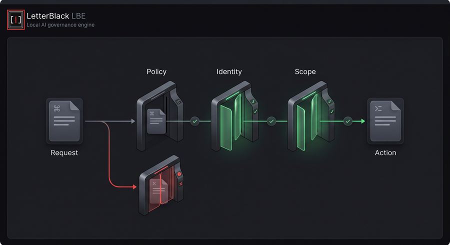
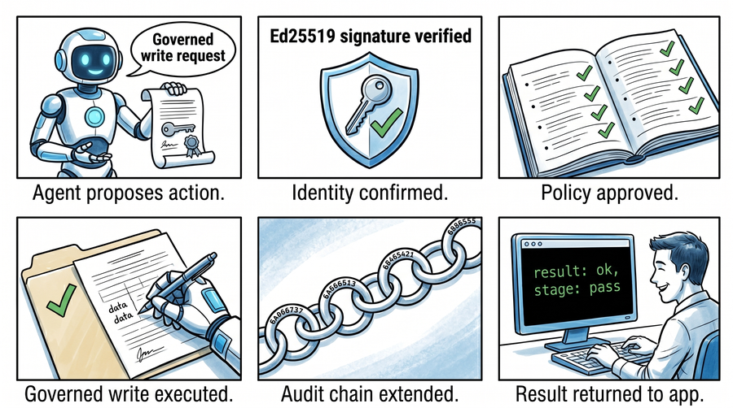
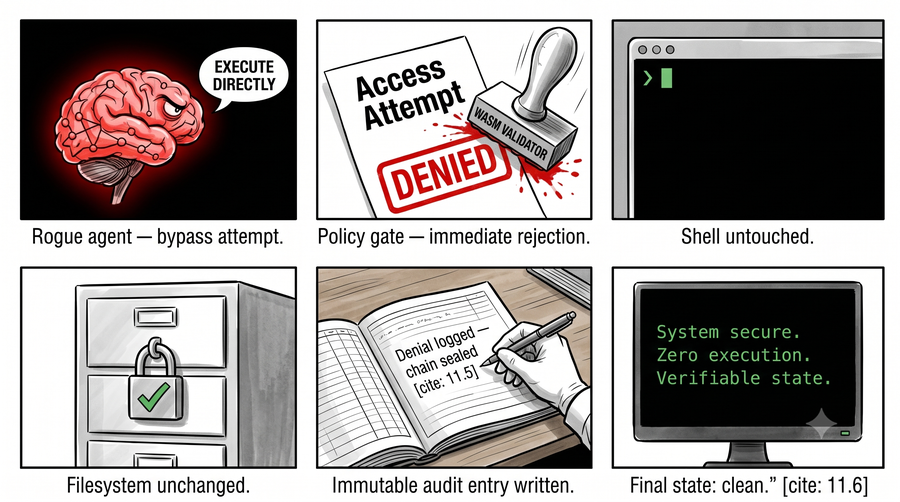

# LBE Core — Execution Governance for Autonomous AI Agents

<p align="center"></p>

<p align="center">
  <a href="#why-lbe">Why</a> ·
  <a href="#what-lbe-does">What</a> ·
  <a href="#who-it-is-for">Who</a> ·
  <a href="#how-it-works">How</a> ·
  <a href="#what-lbe-is-not">Limits</a> ·
  <a href="#request-flow">Flow</a> ·
  <a href="#install">Install</a> ·
  <a href="#terminal-menu-guide">Menu</a>
</p>

---

### Why LBE?

AI agents are powerful. They can write files, run commands, edit configurations, and trigger workflows. But most tools give them unrestricted access — trusting that they will do the right thing.

That trust breaks the moment an agent overwrites the wrong file, runs an unexpected command, or drifts outside the task you assigned.

LBE exists for that moment. It sits between the agent and your system — checking every action before it happens.

### What LBE Does

- **Stops unwanted changes.** Before an agent writes a file or runs a command, LBE checks it against the rules you set.
- **Keeps a record.** Every action is written down so you can review exactly what happened.
- **Gives a clear answer.** Your application gets a simple yes or no — go ahead, or stop.
- **Runs on your machine.** No cloud. No accounts. Nothing leaves your computer.

### Who It Is For

| You are... | LBE helps you... |
|---|---|
| A developer using AI coding assistants | Set boundaries so the agent only touches files you approve |
| A platform builder integrating agents | Add a safety check before your system runs agent-generated commands |
| A team lead managing AI-assisted projects | Review what agents actually did versus what they were asked to do |
| Anyone running automated workflows | Keep a log of every change, so nothing happens without a trace |

<p align="center"></p>

Current release: `@letterblack/lbe-core@1.3.40` · Node.js >= 20.9.0 · Zero external dependencies

## How It Works

Imagine you have asked an AI agent to work on your project. Before the agent can change a file or run a command, LBE steps in and asks a few simple questions:

- **What is the agent trying to do?** — LBE checks the action before it happens. If the agent wants to write a file or run a command, LBE looks at it first.

- **Is this allowed?** — You decide which files and folders the agent can touch. Everything else is off-limits. The agent stays inside the boundaries you set.

- **What happened?** — Every action gets written down. You can look back and see exactly what the agent did, when it did it, and whether it was allowed or blocked.

- **What should the host do?** — LBE gives your application a clear answer: go ahead, or stop here. No guessing. Your code decides what happens next.

LBE does not change how the agent thinks. It simply makes sure the agent cannot do anything your project has not permitted.

<p align="center"></p>

## What LBE Is Not

LBE does one thing: it checks actions before they happen. It is not:

- A replacement for the AI model itself. LBE does not make the agent smarter or change how it thinks.
- A code editor or visual dashboard. There is no window to click around in — it works from the terminal.
- A full system sandbox. It only watches the actions you route through it. It cannot lock down your entire machine.
- A cloud service. Nothing leaves your computer. There are no accounts, no servers, and no subscriptions.

If an agent finds a way to act without going through LBE, LBE cannot see it. The protection is only as strong as the path you give it.

## Request Flow

### Allowed Request

<p align="center"></p>

### Denied Request

<p align="center"></p>

## Install

```bash
npm install @letterblack/lbe-core
```

Requires Node.js >= 20.9.0.

LBE works per workspace — not system-wide. Each project you want to protect needs its own setup. This gives you the flexibility to have different rules for different projects, and keeps projects fully independent.

```bash
cd your-project
npx lbe
```

### Automation & CI/CD Pipelines

For headless pipelines, automated agents, or strict continuous integration verification, direct command bindings are exposed natively:

```bash
npx lbe init    # Initialize runtime schemas and configuration state
npx lbe status  # Evaluate current workspace policy compliance
npx lbe proof   # Export historical local validation payloads
```

## Terminal Menu Guide

Running `npx lbe` with no arguments opens the branded terminal menu — a keyboard-navigated interface that provides the primary control surface for managing workspace protection.

Navigate using the **up/down arrow keys** and press **Enter** to select. Press **Esc** or **q** to exit at any time.

```
┌─────────────────────────────────────────────────────┐
│                                                     │
│              LetterBlack Sentinel                   │
│            Local Execution Governance               │
│                                                     │
│  ❯ Set Up Protection                                │
│    Remove Protection                                │
│    Check Status                                     │
│    Review Activity                                  │
│    Task Rules                                       │
│    Exit                                             │
│                                                     │
│  Use arrows, Enter to select, Esc/q to quit         │
└─────────────────────────────────────────────────────┘
```

### Set Up Protection

**What protection does this provide?** AI agents can write files, run commands, and make changes to your project. Without protection, an agent can accidentally overwrite important code, delete configuration, or run a command you never approved. This option puts a safety layer between the agent and your workspace.

When you first run this, LBE starts in Monitor mode — it logs everything the agent does, but does not block anything yet. This lets you see what is happening before you switch to Protect mode.

**When to use:** First time setting up LBE in a project. Also use to refresh or repair the local configuration if settings were removed or corrupted.

**What happens:**
- A local workspace folder is created to hold your rules and activity logs
- Protection starts in Monitor mode (log only, no blocking)
- The activity tracking system is prepared
- The workspace is identified and ready for use

### Remove Protection

Clears all LBE configuration and activity logs from the current workspace. You will be prompted to confirm before deletion and can choose to preserve the activity history for audit purposes.

**When to use:** When migrating a project away from LBE, cleaning up a test workspace, or resetting all rules to start fresh.

**What happens:**
- Removes local configuration files
- Clears workspace protection rules
- Optionally preserves activity history
- Removes managed references from project files

### Check Status

Displays a live summary of the current workspace state including whether protection is active, how many rules are configured, and the current operating mode.

**When to use:** Regularly during development to verify protection is active. Before running automated pipelines to confirm the workspace is in the expected state.

**What happens:**
- Shows whether protection is initialized
- Displays the current mode (monitor or protect)
- Reports the number of active rules
- Shows the latest task result if available

### Review Activity

Opens the activity log showing recent operations that passed through the LBE boundary. Each entry includes what action was evaluated, when it occurred, and whether it was allowed or blocked.

**When to use:** After an AI agent completes a task to review what files were modified. When investigating unexpected changes. Before accepting agent-generated work.

**What happens:**
- Displays recent activity entries in chronological order
- Shows which files were accessed or modified
- Indicates whether each action was approved or blocked
- Provides a timestamp for each recorded event

### Task Rules

Defines the boundaries and requirements for agent tasks in this workspace. Rules are per-project — each workspace can have its own set of allowances and restrictions, independent of other projects on your machine.

You can set the objective, specify which files and directories the agent is permitted to touch, list forbidden paths, and declare required validation checks.

**When to use:** Before starting any AI-assisted development session. When onboarding a new agent to a project. When updating the scope of work for an ongoing task.

**What happens:**
- Prompts for a task objective or goal
- Accepts a list of allowed file paths or patterns
- Accepts a list of forbidden file paths or patterns
- Accepts required validation checks (e.g., tests must pass)
- Optionally links custom instruction files for agent guidance

### Exit

Closes the terminal menu and returns to the shell prompt. No changes are made.

---

LBE Core provides a local execution governance layer that validates, audits, and records AI agent actions before they reach your host environment. It does not replace your AI — it helps you trust what it executes.
