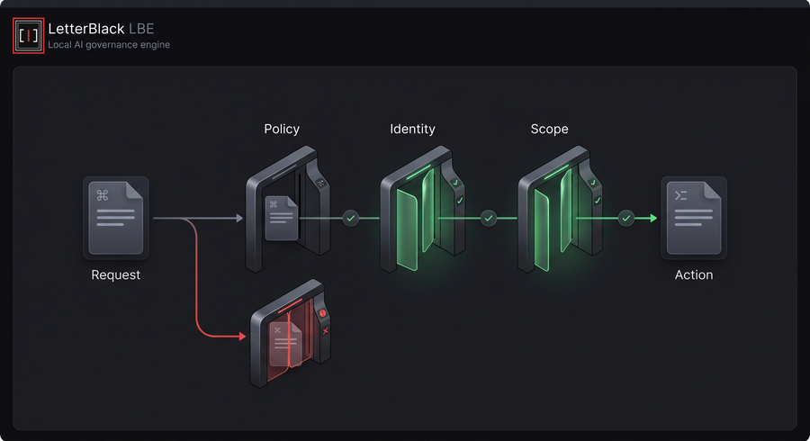
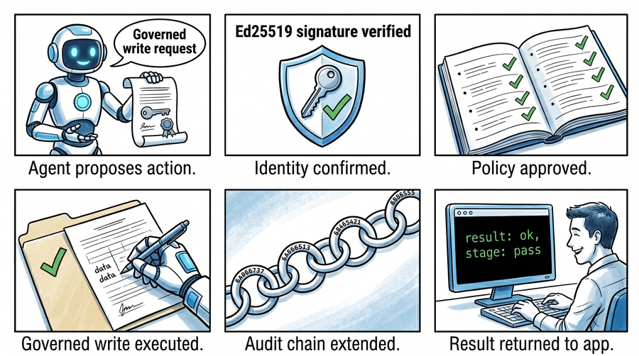
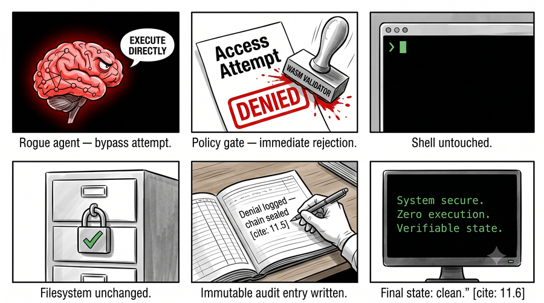

# Technical Visuals

These public visuals are kept for technical reviewers who want a deeper look at the LBE decision model.

They are intentionally not featured in the main README front page. The README should stay focused on install, the simple host/LBE workflow, and practical commands.

## Validation Gates

Use this when explaining the layered validation model behind an LBE decision.

## Allowed Request Story

Use this when explaining a request that stays inside declared policy and scope.

## Denied Request Story

Use this when explaining a request that should not be accepted by the host.
